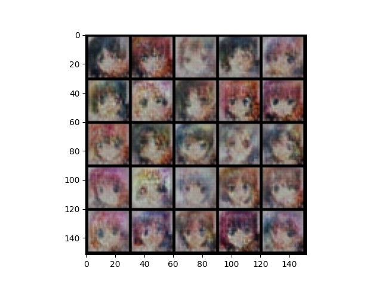

# Producing anime images with WGAN



### Setting up environment

```
# Create the environment in conda with python version 3.6
conda create -n myenv python=3.6

# Activate the environment
conda activate myenv

# Install the packages
pip install -r requirements.txt
```


### Preparing the datasets

The training anime images were downloaded from kaggle.(https://www.kaggle.com/splcher/animefacedataset). There were 63536 images in total. For this model, only 10000 images were used for training.

### WGAN model

A reference of the model was made in the GAN specilization on Coursera by DeepLearning.AI. (https://www.coursera.org/learn/build-basic-generative-adversarial-networks-gans/programming/mTm3U/wgan.) From week 1 course 3, there was a WGAN notebook that was used for training MNIST datasets. Some of the functions and the network of the model were utilized here. 

### Training the model

For training the model, the images downloaded are put in a specific directory. It should be specified in data.py. For saving the parameters of the model, a file is created at the directory specified in train.py. Therefore, a directory should also be specified in train.py for saving the model parameters. 

### Testing the model

The model was pre-trained and the model parameters are saved in {gen_save_name}. To test the model, a directory where this file was saved should be specified in test.py in order to load the parameters for testing. An image with the format like the one at the beginning of README.md should be generated with matplotlib.

